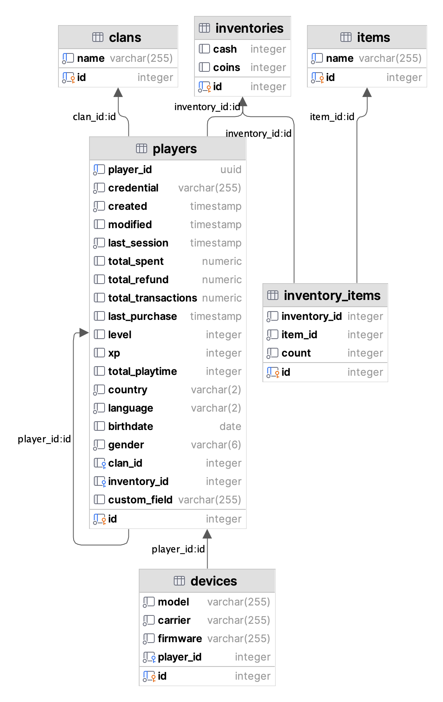

# profile-matcher

## Run config:

* Cd to profile-matcher project directory and run:

```bash
sh run.sh
```

* After initialization finalised you can run: 

```bash
curl --location 'localhost:8080/api/players/get_client_config/dc09fa42-2578-4c02-8dec-9bd231da907b'
```


